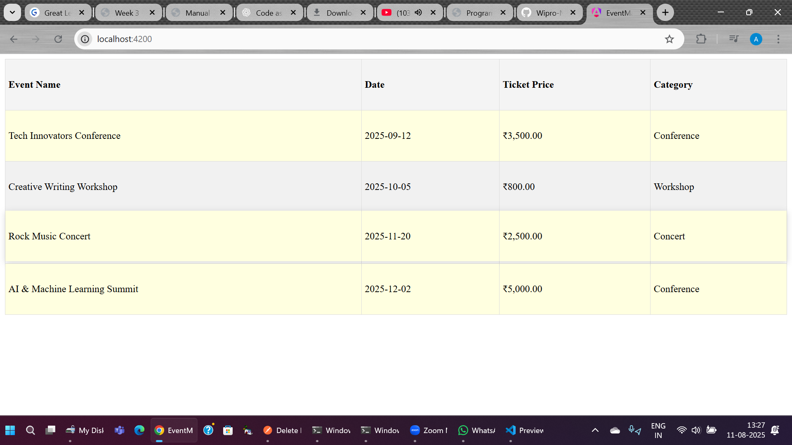

Here’s a **README.md** that follows the submission guidelines from your PDF and matches your Event Management App implementation.

---

````md
# 🎟️ Event Management App (Angular)

A simple **Event Management Portal* built with Angular that displays a list of upcoming events, formats ticket prices, and highlights premium events.

This project demonstrates:
- **Angular Components**
- **Custom Pipes** for price formatting
- **Custom Directives** for highlighting premium events
- **Basic animations & hover effects**

---

## 📌 Features

### 1. Event List Component
- Displays event details: **Name**, **Date**, **Ticket Price**, **Category**
- Uses `*ngFor` for dynamic rendering
- Styled for clarity and readability

### 2. PriceFormatPipe
- Formats ticket prices in **Indian currency format**
- Example:  
  `500 → ₹500.00`  
  `1200 → ₹1,200.00`

### 3. HighlightDirective
- Highlights premium events (**ticket price > ₹2000**) with **light gold background**
- Adds a **hover animation** for premium events (subtle lift + shadow)

---

## 🛠️ Installation & Setup

1. **Clone the repository**
   ```bash
   git clone 
   cd event-management-app
````

2. **Install dependencies**

   ```bash
   npm install
   ```

3. **Run the application**

   ```bash
   ng serve
   ```

4. **Open in browser**

   ```
   http://localhost:4200
   ```

---

## 📂 Project Structure

```
src/
 ├── app/
 │   ├── components/
 │   │   └── event-list/
 │   │       ├── event-list-component.component.ts
 │   │       ├── event-list-component.component.html
 │   │       └── event-list-component.component.scss
 │   ├── directives/
 │   │   └── highlight-directive.directive.ts
 │   ├── pipes/
 │   │   └── price-format-pipe.pipe.ts
 │   └── app.module.ts
 ├── assets/
 └── styles.scss
```

---

## 📊 Sample Data

```ts
events = [
  { name: 'Tech Innovators Conference', date: '2025-09-12', price: 3500, category: 'Conference' },
  { name: 'Creative Writing Workshop', date: '2025-10-05', price: 800, category: 'Workshop' },
  { name: 'Rock Music Concert', date: '2025-11-20', price: 2500, category: 'Concert' },
  { name: 'AI & Machine Learning Summit', date: '2025-12-02', price: 5000, category: 'Conference' }
];
```

---

## 🖼️ Screenshot

**Event List with Price Formatting & Highlighting**
**

---

## 📚 Technologies Used

* Angular 17+
* TypeScript
* HTML5
* SCSS / CSS
* Renderer2 & HostListener for DOM manipulation

---

## ✨ Author

**Ankit Dwivedi**

🔗 [GitHub](https://github.com/Ankit-Dwivedi-code/) 


